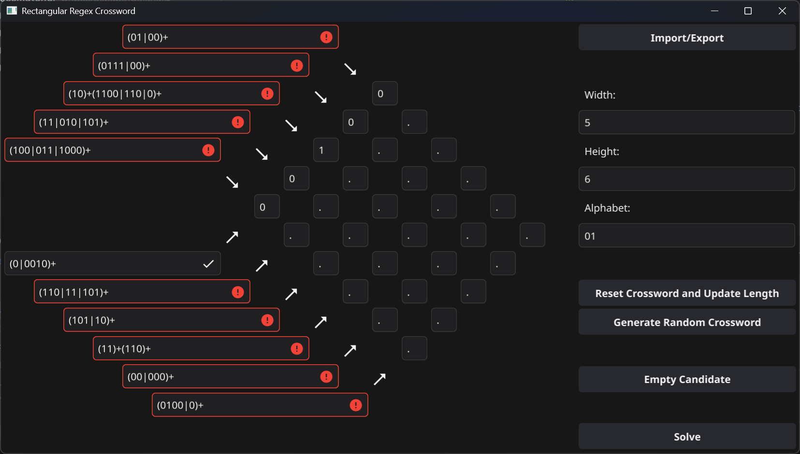

# CrossMatcher

CrossMatcher is a hobby project designed to create, solve, and let users solve **regex crosswords**! It's a playful tool for regex enthusiasts, puzzle lovers, and programmers who appreciate crafting and solving unique challenges.



---

## Features

### Implemented Features
- Generate **regex crosswords** with guaranteed unique solutions.
- A **GUI built with Fyne** to interact with your crosswords:
    - Solve the crosswords and get visual feedback (rules are marked with checkmarks upon satisfaction).
    - Automatically solve crosswords or generate new puzzles at the click of a button.
    - Import/export crosswords and solution candidates as needed.
- Some basic heuristics in order to ensure crosswords with interesting rule sets.

---

### Possible Future Features
Currently, I don't plan on continuing the project. However, some possible extensions would be
- A **heuristic measure** for crossword "interestingness", to generate crosswords that have a more human designed feel.
- Support for **more complex shapes**, like hexagonal or even multidimensional crosswords.
- Experimental rules that **deviate from the current regex pattern** `(A|B|C)+...(W|X|Y|Z)+`.

---

## Installation and Use

### Prerequisites
- Ensure you have [Go](https://golang.org/) installed.
- Install the [Fyne GUI toolkit](https://fyne.io/) for rendering the application. Refer to the Fyne installation guide for specific details based on your environment.

### How to Run
1. Clone this repository:
   ```bash
   git clone https://github.com/JulianPL/crossmatcher
   ```

2. Navigate to the project directory and build the executable:
    ```
    cd crossmatcher
    go build
    ```

3. Run the program

### How to Use the Program


1.  **Start the GUI**: Launch the program, and the CrossMatcher GUI will appear with a predefined crossword.
2.  Interactive Features:
    -   **Solve a Crossword**: Enter your candidate solutions for the rows and columns. Rules that are satisfied are marked with a checkmark for clarity.
    -   **Generate a New Crossword**: Press the "Generate Random Crossword" button to create a new regex crossword with a unique solution.
    -   **Solve Automatically**: Let the program solve the crossword for you and admire its regex wizardry.
    -   **Import/Export**: Save your progress and work on it later by importing/exporting the current crossword and its solution candidates.
3.  **Regex-Filled Fun**: Play, learn, and explore the world of regex crosswords.

## License

This project is licensed under the MIT License, meaning anyone can freely fork the project, modify it, and share their own versions. Contributions and ideas are always welcome!

To contribute directly, feel free to open an issue or contact me directly. Forking is also encouraged if you'd like to build your own version with your personal touches.

## Known Limitations and Target Audience

While the project is intuitive for developers who enjoy working with regex, it does require building the program from source. Therefore, it is most suited for:

-   Programmers familiar with regex patterns.
-   Puzzle enthusiasts who enjoy regex-based logic.
-   Developers interested in exploring Go and the Fyne GUI library.

At this time, the program is not tailored for non-programmers or users without Go development experience.

## Acknowledgments

CrossMatcher was built using the Fyne toolkit, a Go-based GUI framework. The program's inspiration stems from the joy of solving challenging logic puzzles and flexing regex muscles!

Feedback on improving the project or expanding functionality is always appreciated. Don't be shy—regex is all about experimentation!


